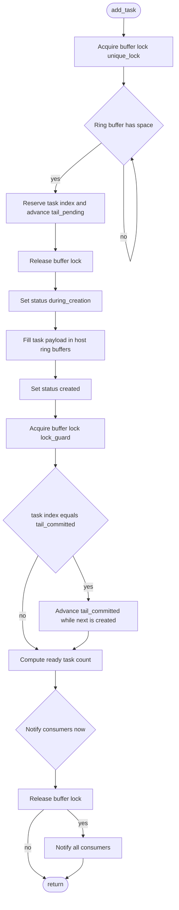

## Flowchart: `SauterQuadratureTaskRingBuffer::add_task()`

### Notes
- **Ring-buffer pointers**
  - `tail_pending`: next insertion position reserved for a producer (advanced under `buffer_lock` before payload is written).
  - `tail_committed`: end of the contiguous “ready-for-processing” region; advanced only when the current task fills the next gap.
- **Statuses**
  - `during_creation` is set before writing payload fields.
  - `created` is set after payload fields are written; consumers can only fetch tasks in `created` state.
- **Notification policy**
  - Consumers are woken when at least `batch_size` tasks are ready, or when the buffer is full but there is at least one ready task (to avoid deadlock on a full buffer with a partial batch).
