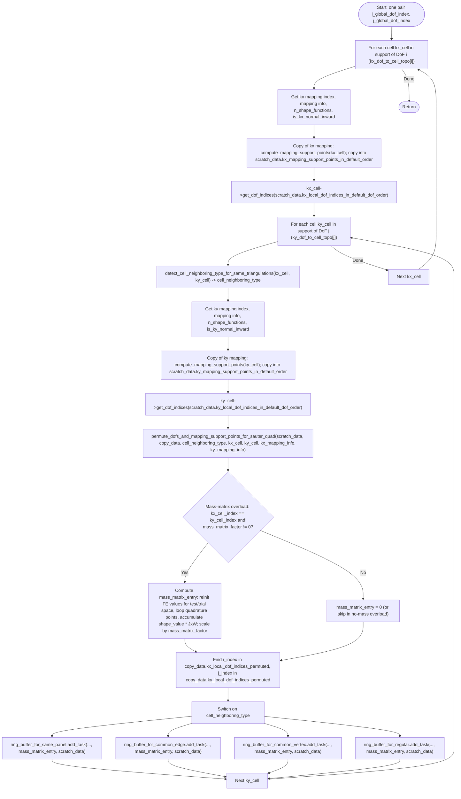

# create_sauter_quadrature_tasks_on_one_pair_of_dofs

Workflow for creating Sauter quadrature tasks for one pair of global DoFs. Defined in `include/quadrature/sauter_quadrature.hcu`. Two overloads: without mass matrix (~line 6553) and with mass matrix (~line 6898); control flow is the same except for the optional mass-matrix entry computation.

## Notes

- **Same panel / common edge / common vertex / regular:** The cell neighboring type selects which of the four ring buffers receives the task. Each task carries scalar data (i_index, j_index, mapping indices, shape function counts, normal orientation) and a mass matrix entry (0 in the no-mass overload).
- **Mass-matrix overload only:** When both cells are the same and `mass_matrix_factor != 0`, the function computes the FEM mass matrix entry for the (i,j) DoF pair on that cell and passes it into `add_task`; the consumer will add this to the Sauter quadrature result.
- **Permutation:** `permute_dofs_and_mapping_support_points_for_sauter_quad` orders DoFs and support points according to the Sauter quadrature rules for the given cell neighboring type; `i_index` and `j_index` refer to these permuted orderings.
