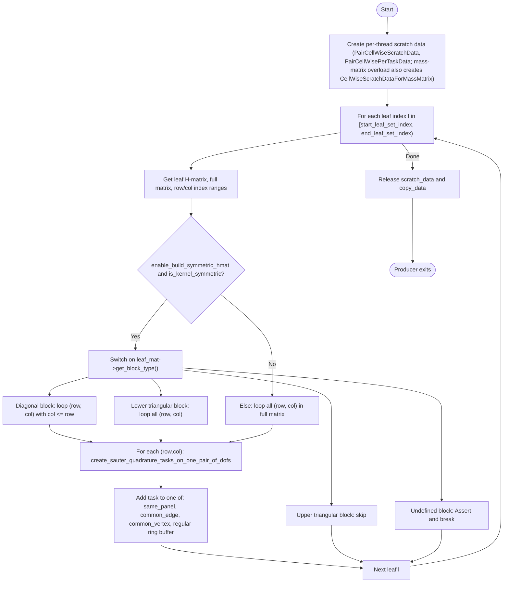

# Producer: sauter_quadrature_for_near_field_matrix_entries_producer

Workflow of the producer thread function in `include/quadrature/sauter_quadrature.hcu` (both overloads share this control flow).

